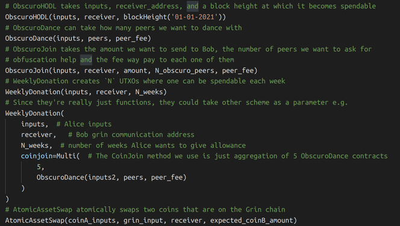
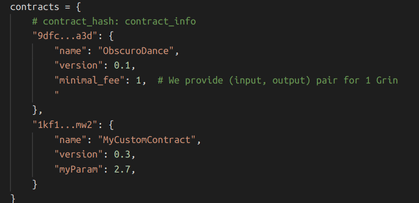

# MW Transaction Contracts
If you have not read the [ObscuroJoin](./ObscuroJoin.md) part yet, you should go do that before reading this one as this one shows a generalization of the previous patterns. After seeing ObscuroJoin we can quickly spot that this is just one of the many ways to perform specific transaction contracts. So let's go through transaction contracts that we have encountered so far:
1. **ObscuroTX** - prevents the leaking of inputs and outputs from Alice to Bob
2. **ObscuroDance** - allows buying inputs and outputs from another peer in a secure way for both parties.
3. **ObscuroJoin** - combines ObscuroTX and ObscuroDance contracts to form a transaction that gets obfuscated before it gets seen by anyone.

There are many more contracts that are useful and possible to do. One thing we learned from ObscuroJoin is that we can compose existing contracts together to form another contract.

## Some other possible contracts

### WeeklyDonation contract
Alice has a friend Bob and wants to give him a donation, 30 Grin each week for the next 6 months. Alice first finds inputs alice_inputs that together hold `30 * 4 * 6` Grins and creates `alice_fake_utxo` from which she creates `4*6` new outputs, each holding 30 Grin and presenting one week payment. She shows these outputs to Bob and tells him the openings for all of them, but she says he must take each one of them and **for each one create a new transaction** that takes the UTXO and creates exactly 1 UTXO with relative lock height set (the first UTXO will be spendable 1 week after the transaction was recorded on the chain so the relative lock will be set to `BlockN + 1*10080`, and so on), forming together `4*6` new UTXOs where each week, a new one will become spendable. If Bob has followed the contract and created the UTXOs Alice expects, she publishes the transaction. If she is unhappy, she can just ignore everything that happened and Bob won't be able to spend any of her coins because it all started from the fake UTXO that doesn't exist.

_**Note**: The reason Alice requires Bob to create a new transaction for each UTXO to exactly one new UTXO is so that she can be sure that Bob's UTXO holds 30 Grin. Otherwise, she couldn't know the amount that is inside the UTXO without Bob showing her the opening for his UTXO._

### Atomic Swap with Confidential Assets
Let's assume Grin already has Confidential Assets and we have two more native coins called `CoinA` and `CoinB`. Alice can atomically swap her `CoinA` with Bobs `CoinB` by first creating a fake UTXO `coinA -> fake_coinA` that holds the coins she will send to Bob. Then she starts a transaction with Bob that transfers her `CoinA` from `fake_coinA` to Bob and also adds another input that transfers a small amount of Grin coins to Bob (`fake_coinA -> bob_coinA, alice_grin -> bob_grin`). The second UTXO that transfers Grin is there to guarantee the order of the transactions that follow. Alice then waits for Bob to create a new transaction that sends Alice back her Grin by using the `bob_grin` UTXO he received from Alice and also sends `CoinB` to Alice so the transaction is `bob_grin -> alice_grin2, bob_coinB -> alice_coinB`. If Alice is ok with the swap, she can publish the transaction on the chain. She can't steal Bob's `CoinB` because the transactions  are ordered due to `bob_grin` UTXO dependency and is such that she first sends her coins to Bob. Bob can't steal Alice's `CoinA` because she started with a UTXO that does not exist on the chain.

## Contract Parametrization
The contracts can be parametrized to be less static. Possible parametrizations of the contracts above:

We could even make a more generalized contract `RecurringDonation` that also takes the number of days before the next UTXO can be spent instead of assuming it is always a week. Since contracts are really just functions, we can compose them or pass them as a parameter to other contracts.

## MW offline scripts
This seems to be a way to do some sort of conditional computation that happens off-chain but does not require any other software than a way to communicate the intent among participants. Imagine clients having a configuration file which defines the contracts the client supports e.g.

Description of contracts a client supportsNow nodes need to find out which contracts a Grin client supports. Remember that not all of them even have a private key to sign anything. [OpenRPC](https://open-rpc.org/) could be used to solve the problem of finding the contract functionality a client supports by calling the `rpc`.discover to the node which returns its interface.

## What about security?
A neat property here is that we can create be as creative as we want and the Grin chain will still be safe because for every transaction/block we still need to prove that for a given `Outputs-Inputs=Excess` we know an `x` such that `x*G=Excess`. This simple computational model can't hurt the chain as far as I can tell (apart from the kernel waste it can create but this could likely go away if Grin switches to BLS signatures). While this might seem similar to the Lightning Network and hence like a Layer 2 solution, it is really still happening on Layer 1 in the end, it is just done 'offline' and a lot of information can get pruned before it even gets to the chain.