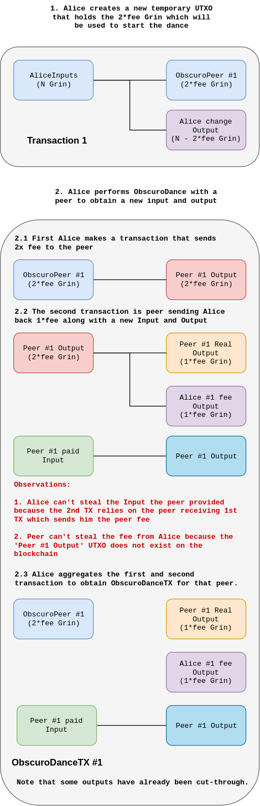

# MimbleWimble ObscuroDance
We have shown what [ObscuroTX](./ObscuroTX.md) looks like. We are going to use this same technique to do a dance with a peer. The purpose of this dance is to obtain new inputs and outputs from a peer in a safe way  which mean that no party can steal from each other.

Note that the UTXO which Alice used to pay the fees was removed via cut-through. The only thing the peer knows is Alice's `1*fee` UTXO. Alice can easily get rid of this by creating a new transaction that sends all the money from Alice's `1*fee` UTXO to a different one and then aggregate this new transaction with transaction `ObscuroDanceTX#1` to get the cut-through remove her `1*fee` UTXO. After this is all done, we've successfully blinded the peer from knowing any of the inputs or outputs apart from their own. Alice now has a new input and output that can help her obfuscate some transaction.

The dance peer can be anyone running Grin and having some UTXOs. There is an incentive to participate because they get paid fees. Whether the peer node client supports and is willing to do the dance could be communicated in many ways.

[Continue to next chapter](./ObscuroJoin.md) to learn about a combination of both ObscuroTx and ObscuroDance.