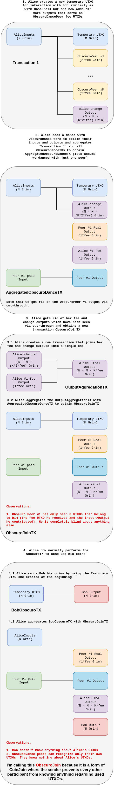

# MimbleWimble ObscuroJoin 
[We have explained](./ObscuroDance.md) an interaction between two parties where one of the parties "buys" inputs and outputs from the other in a safe way. In this chapter, I'll explain an idea that uses the ObscuroDance to provide more anonymity to a transaction. As we know, MimbleWimble transactions can be traced if you simply log them before they hit the blockchain. This is because the transactions don't get aggregated with other transactions before they are sent out. A consequence of this is that anyone can see the transaction graph.
Let's try to improve this by using ObscuroDance.

## ObscuroJoin
We can combine ObscuroTx and ObscuroDance to create a form of CoinJoin. The approach below uses participants I call **ObscuroDancePeers** with which we perform ObscuroDance to get the inputs and outputs that will obfuscate the transaction. I'll start by answering some questions:
1. **Who is ObscuroDancePeer?**

   It can be anyone running Grin that has some UTXOs e.g. the peers we are connected to.
2. **How do we get someone that would be willing to help us obfuscate the transaction?**

   ObscuroDance pays fees to ObscuroDancePeer so they have the incentive to do it.

Before we dive into how ObscuroJoin works, let's first describe what it solves. We end up with a transaction where Alice sends coins to Bob and:
1. **Bob doesn't know ANY input/output** apart from the output holding his coins
2. **ObscuroDancePeer doesn't know ANY input/output** apart from his fee output Alice paid him and the input and output he provided to help obfuscate the graph
3. **Alice can't steal** ObscuroDancePeer inputs
4. **ObscuroDancePeer can't steal** Alice's fees

Once ObscuroJoinTX is published on the blockchain, nobody except Alice knows anything about the inputs/outputs except for their own. The scheme is optimal from the information theory perspective because everyone knows only their own information which is also the theoretical minimum.

Here is how it works:

Note that this would create many kernels which means that we would be bloating the chain. ObscuroJoin, like ObscuroTX, becomes bloat-free if we have the ability to aggregate kernels, regardless of the number of ObscuroDancePeers we involve.

Another thing to note is that while we do need to create `K` transactions where `K` is the number of dance peers, we can do them simultaneously, so the time to perform the ObscuroJoin should not be that slow.

_With this, we have protected Alice by blinding everyone else. If Bob doesn't want Alice to know his UTXO which holds his received money, he could create his own ObscuroJoin and add it along with his output. He will not be as anonymous as Alice because Alice will see his UTXO, but she won't be able to tell which one belongs to him._