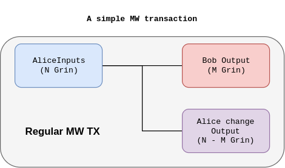
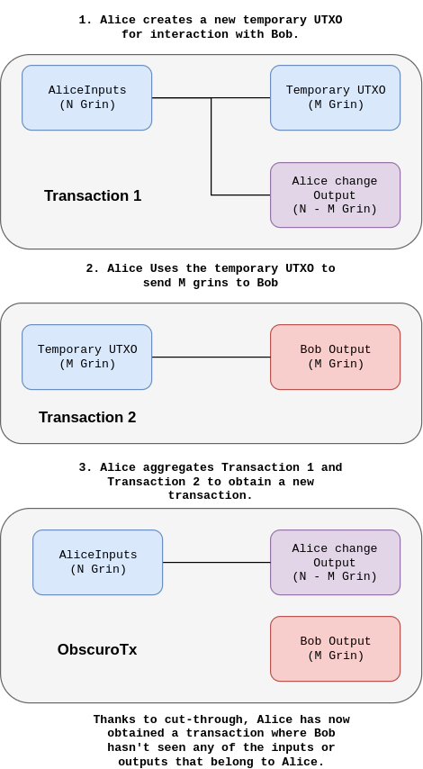

# MimbleWimble ObscuroTX
One of the problems with the UTXO model is that the sender and receiver know information about each other. It's not completely obvious why this would even be a problem. Let's say that Alice wants to send `N` coins to Bob. Bob will know which UTXO has been spent to receive her coins and can link that UTXO to Alice. In a completely open blockchain like Bitcoin, anyone can see that information because everything is public. A blockchain that implements the MimbleWimble protocol tries to tell less about the participants. People that see the UTXO in a block can't tell who it belongs to, however, the receiver of coins Bob can still see the UTXO from which he received the coins when he created the transaction with Alice and also knows Alice's change output. This is a problem because Alice doesn't always trust Bob e.g. Bob could be a random person from which Alice is buying the goods or an exchange where she's transferring money to. Alice does not want to give out more information than absolutely necessary.

## Regular MimbleWimble transaction
A regular transaction on MimbleWimble looks similar to that of Bitcoin in the sense that it uses the UTXO model. The main difference is that the amounts are blinded and the inputs and outputs are not linked. The transactions on MW are however done interactively so if Alice sends coins to Bob, he will see the UTXO (or multiple) that was spent by Alice and also her change UTXO.

Can we hide this information? I think so.

## ObscuroTX
I'll introduce a concept that builds a transaction graph secretly and before it hits the blockchain, it gets pruned and thus gets rid of a lot of information before it becomes public.

That's it. The trick is to create a new temporary UTXO that is not present on the blockchain and instead of publishing 'Transaction 1', we use that UTXO to make the transaction with Bob and later use cut-through to get rid of it. The UTXO that Alice saw will never be seen on the blockchain. This leaves Alice completely blind to any inputs or outputs that Bob has used. She can no longer tell from which UTXO she received the money or which UTXO holds Bob's change. I'm calling this ObscuroTX because the sender completely blinds the receiver of any information. Note that this scheme achieves privacy not by encrypting stuff by rather by never revealing data to the receiver. From the receiver's point of view, assuming that transactions get aggregated, every other input or output (except for their own) is just as likely to belong to Alice.

ObscuroTX would need 2 kernels (one for each transaction) which is one more than a regular MW transaction. If we had the ability to aggregate kernels, the aggregation would provide more privacy because it would be impossible to tell how many transactions took place and we could build ObscuroTX without adding any kernel bloat.

[Continue to ObscuroDance](./ObscuroDance.md) to see other advantages.